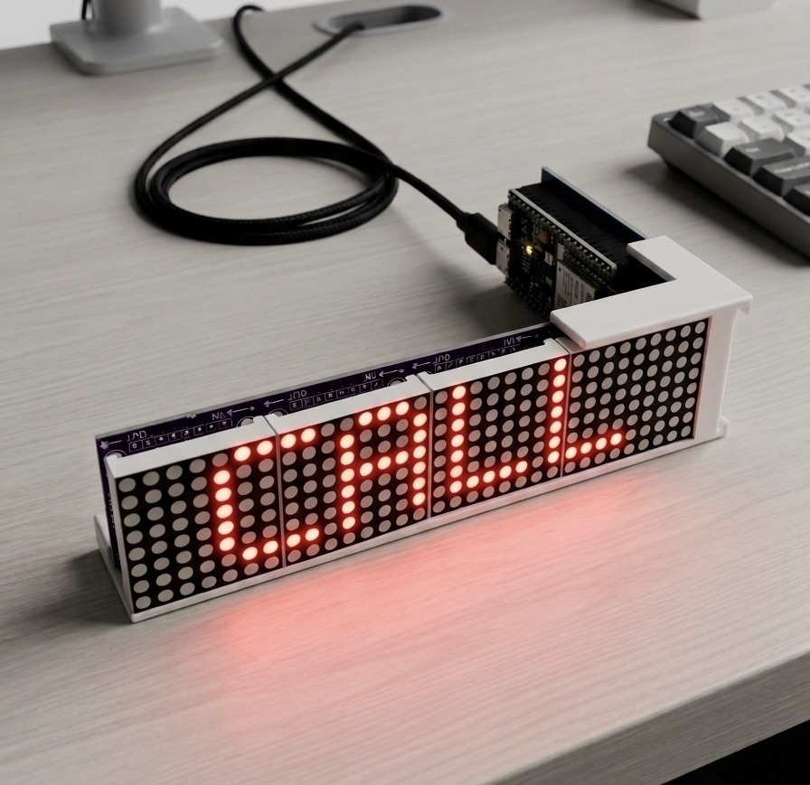
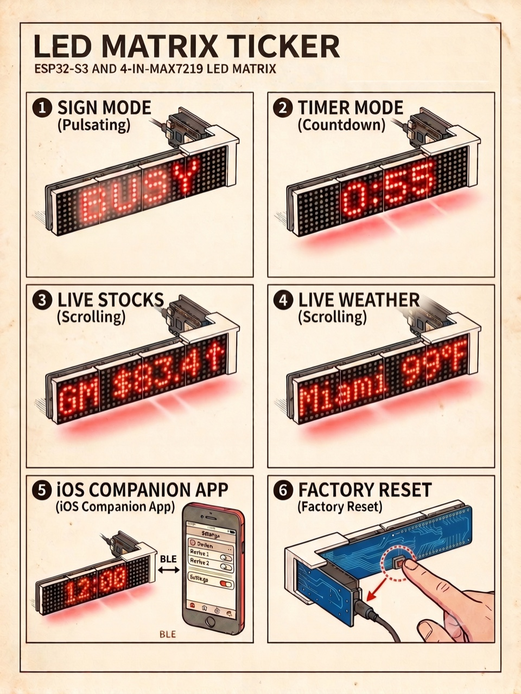

# LED Matrix Ticker

Desk sign + ambient ticker built on an ESP32-S3 and a DIYables 4-in-1 MAX7219 LED matrix. Rotates stocks, weather, and a clock; flips to a steady sign ("BUSY", "FOCUS", "ON AIR") on demand with an optional auto-clear timer.

🔗 **[Project page →](https://ssayala.github.io/esp32-led-simple/)**

<p align="center">
  
</p>

## Features

- **Sign mode** — one-tap status text that overrides the ambient rotation, with an optional auto-clear timer. Or run a **countdown timer** (1–99 min): a live `MM:SS`, a random end animation (fireworks, sonar, sparkle), then back to ambient.
- **Display on/off** — blank the matrix and pause fetches without losing the saved ambient mode. Volatile, so a power cycle returns to on.
- **Live data** — stock quotes (Finnhub) and multi-location weather (Open-Meteo, geocoded on-device).
- **12-hour clock** — steady `H:MM` when shown alone, scrolls `H:MM AM/PM` when mixed in. Timezone via `TIMEZONE` in `src/config.h`.
- **Companion [iOS app](ios/README.md)** — multi-device switcher, preset chip grid, and a Display tab with per-category toggles plus a master on/off.
- **Configured entirely over BLE** — no build-time secrets; WiFi, Finnhub key, tickers, locations, mode, and active sign all set wirelessly and persisted in NVS.
- **PIN-gated BLE** — every write gated on a 6-digit PIN. iOS uses the native pairing dialog; the CLI sends it via a dedicated Auth characteristic. Generated on first boot, rotates on factory reset.
- **Factory reset** — hold the BOOT button (GPIO 0) for 10 s (the matrix counts down from the 2 s mark; release to abort). Wipes all NVS, forgets every BLE bond, and reboots into setup mode with a fresh PIN.

<p align="center">
  
</p>

## Hardware

Targets one specific board. The custom PCB is sized for the same module.

| Component | Part |
|-----------|------|
| MCU board | [**Freenove ESP32-S3-WROOM (FNK0099)**](https://store.freenove.com/products/fnk0099) — onboard NeoPixel on GPIO 48, native USB-CDC |
| Display | [DIYables 4-in-1 MAX7219 8x8 LED matrix](https://diyables.io/products/dot-matrix-display-fc16-4-in-1-32x4-led) |

### Wiring (matches the PCB)

| Matrix Pin | ESP32-S3 GPIO |
|------------|---------------|
| VCC | 5V |
| GND | GND |
| DIN | 6 (MOSI) |
| CLK | 4 (SCK) |
| CS | 5 |

Onboard RGB LED (GPIO 48) lights blue during network fetches. The Freenove board's **BOOT button (GPIO 0)** doubles as the factory-reset trigger — hold for 10 s during normal runtime; see Features above.

**Using a different ESP32-S3 board?** Edit `DIN_PIN` / `CLK_PIN` / `CS_PIN` / `RGB_LED_PIN` in `src/config.h`. The PCB has no flexibility — it's footprint-specific to the FNK0099.

## Custom PCB

Carries the Freenove module + a MAX7219 matrix header on a single board. Designed in [EasyEDA](https://easyeda.com/); order via JLCPCB. Sources, mechanical drawing, 3D model, and render are all in [`pcb/`](pcb/).

<p align="center">
  
</p>

## Quick start

1. Install [PlatformIO](https://platformio.org/).
2. Optionally edit defaults in `src/config.h` — seed tickers/locations (first-boot NVS seed) plus user tunables (timezone, scroll speed, brightness, fetch interval, NTP server).
3. Build and upload: `pio run -t upload`. Press the physical reset button after flashing.
4. On first boot the display scrolls the BLE device name **and a 6-digit PIN** (e.g. `LED-Ticker-AB12  PIN 482 913`). Note the PIN — you'll need it on every client.
5. **iOS:** open the app, tap the device. iOS pops a system "Bluetooth Pairing Request" dialog — type the PIN. Bonded. Future reconnects skip the dialog.
6. **CLI:** save the PIN once; future calls auto-include it:
   ```
   uv run tools/led.py pin 482913
   uv run tools/led.py wifi My Network Name password123
   uv run tools/led.py apikey your-finnhub-key
   ```
   The last arg to `wifi` is always the password — everything before it is the SSID, so spaces work naturally.

   If you ever forget the PIN, read it off the serial monitor (`pio device monitor`) at boot, or factory-reset to rotate it.

## CLI control

The device advertises as `LED-Ticker-XXXX`. `tools/led.py` is a [bleak](https://github.com/hbldh/bleak)-based CLI you can run from any machine with Bluetooth:

```bash
# Sign mode
uv run tools/led.py status "BUSY" 30      # show for 30 min, then auto-clear
uv run tools/led.py status "ON AIR"       # indefinite
uv run tools/led.py status clear

# Timer mode (countdown sign — random animation at zero, then resumes ambient)
uv run tools/led.py timer 10              # 10-minute countdown
uv run tools/led.py timer cancel

# Ambient mode (subset of stocks/weather/clock, 'all', or 'none' for sign-only)
uv run tools/led.py mode stocks weather
uv run tools/led.py mode clock
uv run tools/led.py mode all
uv run tools/led.py mode none

# Power (volatile — power cycle returns to on)
uv run tools/led.py power on
uv run tools/led.py power off

# Data
uv run tools/led.py tickers AAPL TSLA NVDA SPY
uv run tools/led.py locations "Seattle, WA" 98052
uv run tools/led.py apikey your-finnhub-key
uv run tools/led.py wifi My Network Name password

# Inspect
uv run tools/led.py get version           # firmware version on the device
uv run tools/led.py get wifi|apikey|tickers|status|locations|mode|power  # read other settings

# Auth
uv run tools/led.py pin 482913            # save the device's PIN locally (~/.config/led-ticker/pin)
uv run tools/led.py pin clear             # forget the saved PIN
uv run tools/led.py pin-enforce on        # device: require PIN for writes (default after a fresh flash)
uv run tools/led.py pin-enforce off       # device: stop requiring PIN (escape hatch)

# Maintenance
uv run tools/led.py reload                # force stock refresh
uv run tools/led.py reset                 # wipe NVS, rotate PIN, revert to config.h defaults
```

Stale-PIN safety: every write probes the device after sending the PIN and exits with a clear error if the PIN was rotated by a factory reset. You'll never silently lose a write because of an out-of-date local PIN.

## BLE protocol

For building a custom BLE client, see [BLE_PROTOCOL.md](BLE_PROTOCOL.md) — UUID table, payload formats, semantics, cooldown.

## Versioning

Firmware version lives in [`src/version.h`](src/version.h) as a single `FW_VERSION` `#define` (semver `MAJOR.MINOR.PATCH`). It's printed on Serial at boot, exposed as a read-only BLE characteristic, and shown in the iOS app's Device tab and via `uv run tools/led.py get version`. The per-release bump/tag/flash workflow is documented in [`CLAUDE.md`](CLAUDE.md#versioning).

## Configuration

**User tunables — `src/config.h`:**

| Define | Default | Description |
|--------|---------|-------------|
| `SCROLL_SPEED` | 60 | ms per scroll step (lower = faster) |
| `SETUP_SCROLL_SPEED` | 100 | Slower scroll used only in setup mode so the BLE name + PIN are easy to read. Reverts to `SCROLL_SPEED` once setup completes. |
| `DISPLAY_INTENSITY` | 2 | LED brightness, 0–15. Idle mode (post-sign with no ambient data) dims to 0 regardless of this setting. |
| `SIGN_BREATH_MIN/MAX_INTENSITY`, `STEP_MS` | 1 / 6 / 400 | Subtle brightness pulse on static signs. Tune the three together — changing one in isolation loses the "breath" feel. |
| `TIMEZONE` | `PST8PDT,M3.2.0,M11.1.0` | POSIX TZ string |
| `NTP_SERVER` | `pool.ntp.org` | NTP host |
| `FETCH_INTERVAL_MS` | 5 min | Stock + weather refresh interval |

**Hardware pins — `src/config.h`:** `HARDWARE_TYPE`, `MAX_DEVICES` (4), `DIN_PIN`/`CLK_PIN`/`CS_PIN` (6/4/5), `RGB_LED_PIN` (48), `BUTTON_PIN` (0). Edit these when porting to a different board — see [Hardware](#hardware) above.
