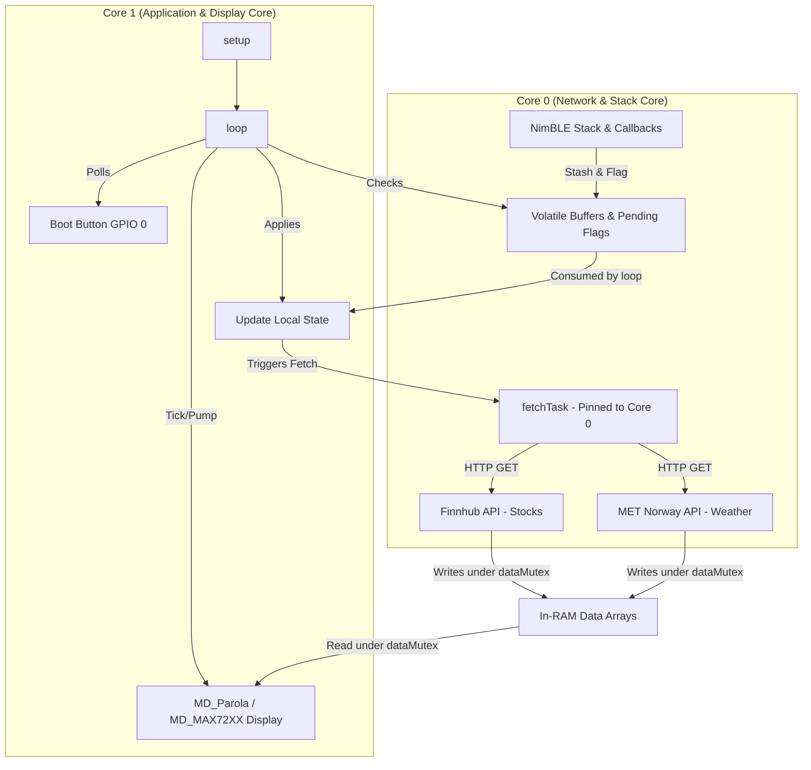
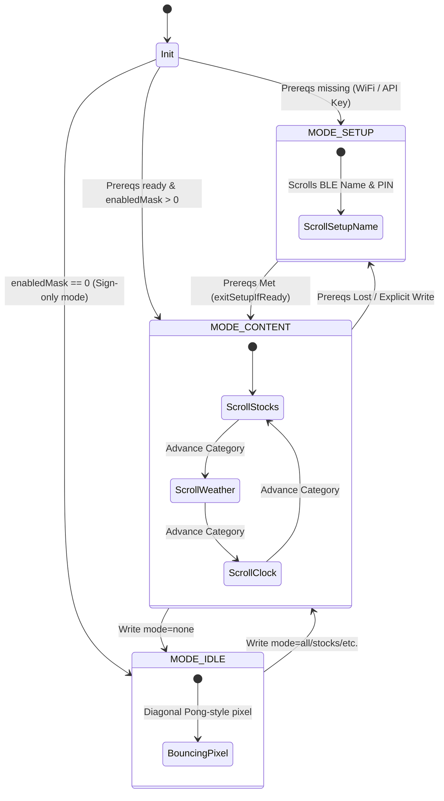

# Firmware Deep-Dive and Interaction Guide

The single source for ESP32-S3 LED Ticker firmware internals (`firmware/src/main.cpp`): the dual-core model, the display state machine and its edge cases, BLE write handling, data pipeline, security, memory-safety rules, and checklists for extending the firmware.

The BLE wire contract — UUIDs, payload strings, command verbs, timezone/power formats — lives in [`BLE_PROTOCOL.md`](../BLE_PROTOCOL.md). This guide covers the *firmware side* of that contract; read them together when touching BLE.

---

## 1. System Architecture & Multitasking

The firmware is built around a dual-core model so network latency (seconds) never interrupts the smooth scrolling of the LED matrix.



### 1.1 Core Assignment
- **Core 0 (`fetchTask`):** background HTTP/HTTPS to external APIs (Finnhub stocks; MET Norway weather). Pinned to Core 0 with an 8 KB stack (`FETCH_TASK_STACK = 8192`).
- **Core 1 (`setup()` / `loop()`):** drives the MAX7219 matrix, polls the hardware button, tracks BLE connections, and applies deferred state updates.

### 1.2 Data Synchronization & Thread Safety
- **`dataMutex` (FreeRTOS semaphore):** guards reads/writes of `stockQuotes` and `weatherReadings`.
  ```cpp
  xSemaphoreTake(dataMutex, portMAX_DELAY);
  // Copy or read array elements
  xSemaphoreGive(dataMutex);
  ```
- **Deferred apply:** Every BLE callback (running in a NimBLE thread on Core 0) copies its payload into a `pending*` buffer and sets a volatile `*UpdatePending` flag. Core 1 polls these flags in `loop()` and applies changes via `applyPending*()`. **No network or display work inside callbacks.** Full characteristic→buffer→function map in [§5](#5-ble-deferred-write-mapping).
- **NeoPixel gating:** the WS2812 status LED (GPIO 48) is driven only from Core 1. Core 0's fetch task sets the volatile `fetching` flag; Core 1 consumes it in `updateStatusLed()`. **Rule:** never call `neopixelWrite()` from Core 0 — it can lock up the ESP32-S3 RMT driver.

---

## 2. Display Modes & Render Precedence

The firmware has three top-level modes plus orthogonal sign/timer overrides. `loop()` decides what to draw on every tick.



### 2.1 Mode state (`enabledMask`)
`enabledMask` is a subset of `BIT_STOCKS | BIT_WEATHER | BIT_CLOCK` = `MASK_ALL` (`0x0D`). Empty mask `0` means sign-only (`MODE_IDLE`). Persisted in NVS namespace `display`, key `mask` (one byte).

- Bit `0x02` is **reserved** (was `BIT_MESSAGES`). Stripped from any legacy NVS mask on load so old configs don't resurrect a dead category.
- `parseModePayload` returns `MASK_NONE_REQUEST = 0x80` as a sentinel for `"none"`, to distinguish it from invalid input (which returns `0`). `applyPendingMode` translates the sentinel back to `enabledMask = 0`.
- The Mode characteristic accepts `"all"`, `"none"`, a single token, or a comma-joined subset like `"stocks,weather"`. `"messages"` is rejected. Reads return canonical form (`"all"`, `"none"`, or comma-joined).
- Within `MODE_CONTENT`, `currentBit` tracks the scrolling category. `advanceCategory()` rotates STOCKS → WEATHER → CLOCK, skipping bits that are disabled or have no data. A single-bit mask never advances.

### 2.2 The three modes

**MODE_CONTENT** — normal ambient rotation. `showNext()` picks content based on `currentBit`.

**MODE_SETUP** — pre-config mode. Scrolls the BLE device name (`LED-Ticker-XXXX`) so the user can find the device to connect to. `setupTargetMask` records the mask to resume into. Entered when:
- Boot with a saved mask whose prereqs aren't met
- User writes a mode whose prereqs are missing
- After `cmd=reset`

Exits via `exitSetupIfReady()` (called from `applyPendingWifi` / `applyPendingApiKey`), or an explicit `mode=` write. **Timeout:** `SETUP_TIMEOUT_MS = 60s` of no BLE activity falls through to `MODE_CONTENT` *only if* `wifiConfigured()` — unmet-prereq bits then show `"Loading X..."`. Without WiFi the timeout no-ops and reschedules (every category needs WiFi). Every characteristic `onWrite` resets the activity timer.

**MODE_IDLE** — a single pixel bouncing diagonally Pong-style at `IDLE_STEP_MS = 150` ms/step via `MD_MAX72xx::setPoint()`. Entered when:
1. `resumeAmbient()` after a sign clears, with `enabledMask == 0` or `maskPrereqsReady(enabledMask)` false
2. Boot with `enabledMask == 0` (`"none"` persisted)
3. `applyPendingMode()` on a `mode=none` write

`enterIdle()` is idempotent w.r.t. pixel position — re-entry preserves col/row/dir but clears the display and forces a first-paint so leftover sign content doesn't ghost. `enabledMask == 0` is sticky: `exitSetupIfReady()` never pulls it out of idle; only a non-`"none"` mode write or a sign override does.

### 2.3 Rendering precedence
Evaluated in this order each tick:
1. **Reset button hold (highest):** GPIO 0 held → screen clears and shows the factory-reset countdown (`"8"`, `"7"`, …).
2. **Display power state:** if `displayOff`, screen is blanked, fetches pause, loop yields (`delay(100)`).
3. **Timer mode** (`timerPhase != TIMER_OFF`): renders countdown `MM:SS` or the zero-minute end animation.
4. **Status sign** (`checkStatusForRender()`): active, unexpired text renders static (breathing if ≤5 chars) or scrolls on a loop.
5. **Idle mode** (`MODE_IDLE`): bouncing diagonal pixel.
6. **Static clock fast path** (§2.4).
7. **Normal scroll pump:** setup scrolls (`MODE_SETUP`) or the rotating categories (`MODE_CONTENT`).

### 2.4 Static clock fast path
When `enabledMask == BIT_CLOCK` (clock only) AND `timeReady` AND no sign is active, `loop()` calls `tickStaticClock()` instead of the scroll pump: steady center-aligned `"H:MM"` (no colon blink), redrawn only on minute change. Before NTP completes the branch is skipped and the scroll path renders `"Loading time..."`. In any mixed mode (`BIT_CLOCK` + another bit) the clock scrolls as `"H:MM AM/PM"` via `showNextClock()` and `advanceCategory()` rotates off it immediately.

---

## 3. Sign & Timer Mode

Both ride a single override slot above ambient and are **mutually exclusive** with each other.

### 3.1 Status sign (Status characteristic `...26af`)
Overrides ambient while `activeStatusText` is non-empty and unexpired.
- `STATUS_STATIC_MAX_CHARS = 5`. ≤5 chars renders steady via `displayText(PA_PRINT, PA_NO_EFFECT)` (with a breathing-brightness effect); longer text scrolls on a loop.
- `statusShown` / `statusShownIsScroll` are file-scope caches so the static path paints once per text change. Out-of-band wipes (clear/expiry/reset) go through `invalidateStatusRender()` so the next tick repaints.
- `clearActiveStatusAndResume()` calls `resumeAmbient()`, which picks content vs idle based on prereqs.

**Expiry sentinels** (`statusExpiresAt`):
- `0` → no status active
- `UINT32_MAX` → indefinite (until cleared)
- otherwise → a `millis()` target

Uses `millis()`, not `time(NULL)`, so timed signs work on no-WiFi devices. Compare via `(int32_t)(millis() - statusExpiresAt) < 0` for wrap safety. Computed targets that collide with a sentinel (0 or `UINT32_MAX`) are bumped to 1. `checkStatusForRender()` is the combined gate-plus-expiry check called once per loop; it returns `false` and clears in place once expiry passes.

**Sign-only inference:** `applyPendingStatus()` auto-persists `enabledMask = 0` on the *first* sign write when `!wifiConfigured() && enabledMask != 0` — a strong signal of sign-only intent, so later power cycles land in `MODE_IDLE` instead of nag-scrolling the BLE name. Setting WiFi creds later does **not** auto-restore categories; the user must write `mode=all` (or similar). `cmd=reset` clears the inference.

### 3.2 Timer mode (countdown sign)
A minute-granular countdown entered via the `timer <minutes>` Command verb (1–99, clamped). It shares the override slot with the text sign but is mutually exclusive: `startTimer()` clears any active text sign so the post-timer resume goes to ambient, and `applyPendingStatus()` cancels a running timer when a new sign is written. State (`TimerPhase` + `timerEndAt`) is **RAM-only**.

- `TIMER_OFF` — inactive; `loop()` renders sign/ambient normally.
- `TIMER_RUN` — `tickTimer()` renders `MM:SS`, ceil-to-second (a fresh N-min timer shows `N:00`, last frame is `0:01`), redrawn only on second change via `lastShownTimerSec`. Static `displayText` path (≤5 chars).
- `TIMER_ANIM` — at zero, `tickEndAnim()` plays one of three end animations (fireworks, sonar, sparkle), picked via `esp_random() % ANIM_COUNT` at the transition. Frame-stepped via `millis()` (no `delay()`), drawn through `getGraphicObject()->setPoint()`, ending in `resumeAmbient()` once `animTotalFrames()` elapses. Per-frame visuals are deterministic via `animHash()` — no RNG state carried across frames.

`loop()` gives the timer top render precedence (ahead of `checkStatusForRender()`). `cmd=reset` forces `TIMER_OFF`. Limitations: RAM-only (power cycle clears it); if `power off` straddles the expiry moment, the end animation plays late when the display comes back on. The timer is fire-and-forget — there is no read-back characteristic, so the iOS app tracks the countdown locally from when it sent the command.

---

## 4. Boot Sequence (`setup()`)

```
initDisplay()
  → load NVS (wifi, apikey, tickers, locs, display, time, pin)
  → buildDeviceName()
  → MODE_SETUP / MODE_IDLE / MODE_CONTENT  based on mask + prereqs
  → showNext()           // display live before networking
  → connectWifi()
  → initTime()           // GATED on WL_CONNECTED — see §9.3
  → initBLE()
  → triggerFetch()
```

`showNext()` runs before networking so the matrix lights immediately. `initTime()` is gated on a live WiFi connection (§9.3) — starting SNTP without one wedges the device.

---

## 5. BLE Deferred-Write Mapping

Each characteristic callback stashes its payload and flags it; Core 1 applies it. The wire payload formats are in [`BLE_PROTOCOL.md`](../BLE_PROTOCOL.md).

| Characteristic | UUID (`beb5483e-36e1-4688-...`) | Callback Class | Stash Buffer | Apply Function | NVS Namespace / Key |
|---|---|---|---|---|---|
| **Tickers** | `...26a8` | `TickerCallbacks` | `pendingTickerStr` | `applyPendingTickers()` | `tickers` / `t0`, `t1`... |
| **Mode** | `...26a9` | `ModeCallbacks` | `pendingModeStr` | `applyPendingMode()` | `display` / `mask` |
| **Command** | `...26ab` | `CmdCallbacks` | `pendingCmd` | `applyPendingCmd()` | *Write-only (NVS wiped on reset)* |
| **WiFi** | `...26ac` | `WifiCallbacks` | `pendingWifiStr` | `applyPendingWifi()` | `wifi` / `ssid`, `pass` |
| **API Key** | `...26ad` | `ApiKeyCallbacks` | `pendingApiKey` | `applyPendingApiKey()` | `apikey` / `key` |
| **Locations** | `...26ae` | `LocsCallbacks` | `pendingLocsStr` | `applyPendingLocations()` | `locs` / `l0`, `l1`... |
| **Status** | `...26af` | `StatusCallbacks` | `pendingStatusStr` | `applyPendingStatus()` | *RAM-only* |
| **Version** | `...26b0` | `VersionCallbacks` | *Read-only* | *None* | *Hardcoded define* |
| **Power** | `...26b1` | `GatedStashCallbacks` | `pendingPowerStr` | `applyPendingPower()` | *RAM-only* |
| **Auth** | `...26b2` | `AuthCallbacks` | *Immediate match* | *Processed in Callback* | `pin` / `code` |
| **Display** | `...26b3` | `DisplayCfgCallbacks` | `pendingDisplayCfgStr`| `applyPendingDisplayCfg()` | `display` / `bright`, `scroll` |
| **Timezone** | `...26b4` | `TimezoneCallbacks` | `pendingTzStr` | `applyPendingTimezone()` | `time` / `tz` |

### 5.1 Network write cooldown
`BLE_FETCH_COOLDOWN_MS = 10s` gates writes that trigger network — ticker updates, location updates, `Command=reload`, `Command=reset` — so client retries can't hammer the APIs. **Status (sign) writes are not gated** — they must feel immediate.

---

## Serial console (dev/test)

A USB-serial command path that mirrors the BLE control plane — handy for local
testing and the **only** way to provision in Wokwi (BLE isn't simulated). Each
command writes the same `pending*` buffer + `*UpdatePending` flag a BLE write
would, so `loop()`'s `applyPending*()` applies it identically.

Open the serial monitor (115200 baud) and type, e.g.:

    wifi MyNetwork mypassword
    apikey d1abc...
    tickers AAPL,MSFT,GOOG
    mode all
    sign HELLO
    timer 5
    info

`info` prints current state; `help` lists every verb. The parser lives in
`src/console.{h,cpp}` (pure, host-tested via `pio test -e native`); the verb
dispatch is in `main.cpp`.

**Security:** the console bypasses the PIN gate. This is intentional — physical
USB access already allows reflashing the chip, so it grants no extra privilege.
`wifi` splits on the first space, so the SSID cannot contain a space (the
password can).

---

## 6. Data Pipeline

### 6.1 Fetch loop
`loop()` calls `triggerFetch()` every `FETCH_INTERVAL_MS` (5 min) while WiFi is up; `fetchTask` (Core 0) performs the HTTP work and writes results under `dataMutex`.

### 6.2 Display gating (`showNext()`)
The rotation skips category bits whose data isn't ready:
- **Stocks:** WiFi + API key configured AND `stockCount > 0`
- **Weather:** WiFi configured AND `weatherCount > 0`
- **Clock:** `timeReady` (NTP synced at least once)

If no enabled bit has data yet, `showNext()` shows `"Loading <category>..."` for `currentBit`. Mode writes whose prereqs are missing get diverted to `MODE_SETUP` by `applyPendingMode`, but the mask is still saved so the device resumes into the user's selection once prereqs are met.

### 6.3 Market hours
`isMarketOpen()` (Mon–Fri 9:30–16:00 ET) gates stock *fetches* only, not display. When closed, last-fetched quotes stay in RAM and the API call is skipped. A cold boot with no data fetches once regardless.

### 6.4 Locations
The device does **not** geocode — the client (iOS app via MapKit, or the CLI) resolves place names to coordinates and sends `lat,lon,label` triplets over the Locations characteristic. `parseLocation()` splits each entry into `resolved[]` (lat/lon + display label) with no network; `reparseLocations()` re-derives the cache on NVS load and on every write. Malformed or out-of-range entries are skipped. `fetchWeatherImpl()` then uses `resolved[i].lat/lon` directly for the MET Norway weather call (current instant from `timeseries[0]`, °C → °F; `User-Agent` required).

### 6.5 RAM-only fetched data
Stocks (`stockQuotes[]`: raw price + `changePct`) and weather (`weatherReadings[]`: raw `tempF`) live only in RAM. Display format (`\x18`/`\x19` arrows, `°F`) is computed on every scroll in `showNextStock()` / `showNextWeather()`, so format changes apply immediately without a reload. The active sign is likewise RAM-only — a power cycle clears it and resumes ambient.

---

## 7. Security, Authentication & Rate Limiting

The BLE interface enforces a PIN-gate on all configuration writes while `nvsPinEnforce` is `true` (default; `Command=pin-enforce off` disables). Wire-level auth semantics are in [`BLE_PROTOCOL.md`](../BLE_PROTOCOL.md#auth).

### 7.1 Pairing paths
1. **Passkey-entry bonding:** standard Bluetooth security (`bond=true`, `MITM=true`, `SC=true`, `DISPLAY_ONLY` capability). iOS prompts its native passcode dialog; `onPassKeyRequest()` returns the NVS PIN.
2. **PIN write (fallback):** writing the PIN directly to the Auth characteristic (`...26b2`) flags the connection handle as authorized. Used by the CLI or clients that can't trigger native bonding.

### 7.2 Auth memory (`AuthSlot`)
Up to 4 concurrent connections are tracked:
```cpp
struct AuthSlot {
  uint16_t handle;
  bool inUse;
  bool authed;
  uint8_t failCount;
  uint32_t lockoutUntilMs;
};
```

### 7.3 Lockout & timing
- **Brute-force defense:** 5 consecutive failed PIN writes on a slot lock further Auth writes on that connection handle for 5 s (`AUTH_LOCKOUT_MS = 5000`).
- **Wrap-safe check:** signed subtraction —
  ```cpp
  if (s->lockoutUntilMs && (int32_t)(millis() - s->lockoutUntilMs) < 0) return; // ignore write
  ```
- **Cleanup:** `ServerCallbacks::onDisconnect()` frees the connection's `AuthSlot`.

---

## 8. Reset Semantics (`cmd=reset` / 10 s BOOT hold)

Both paths are identical: clear *all* NVS namespaces (`wifi`, `apikey`, `tickers`, `locs`, `display`, `time`, `pin`, plus tombstones `msgs` and `status`), delete all BLE bonds, and reboot. The fresh boot rebuilds everything — reseeds tickers/locations from `config.h`, generates a new PIN, and lands in `MODE_SETUP` (WiFi prereqs are gone). The `reset` write is **ACKed before** the apply runs (deferred-apply pattern), so the client gets its response and then sees the connection drop on restart. After reset the device needs WiFi and API key reconfigured over BLE.

---

## 9. Versioning, Serial & Time Gates

### 9.1 Versioning
`FW_VERSION` is a `#define` in `firmware/src/version.h` (semver), bumped manually per release and tagged in git. Surfaced three ways:
- Serial banner at boot (`LED-Ticker firmware vX.Y.Z`)
- Prefix on every `[hb]` heartbeat line (USB-CDC enumeration timing means the boot banner can be missed)
- Read-only Version BLE characteristic (UUID `...26b0`)

iOS reads it on connect. **`.version` is in iOS `CharKind` but NOT in `requiredKinds`**, so older firmware without the characteristic still connects cleanly (`firmwareVersion` stays empty). `tools/led.py get version` reads the same characteristic.

### 9.2 Serial reliability
`Serial.setTxTimeoutMs(0)` runs immediately after `Serial.begin()`. The default 250 ms blocking write is a latent matrix-stutter risk when running headless and the TX buffer fills with no host draining it; timeout `0` drops the bytes instead of blocking the loop. The `delay(2000)` wait-for-`!Serial` only helps catch the boot banner in `pio device monitor` — it's not a correctness requirement.

### 9.3 SNTP time-init gate
`initTime()` (which calls `configTzTime()` / starts NTP) is **gated on `WiFi.status() == WL_CONNECTED`** and no-ops otherwise.
```cpp
if (WiFi.status() != WL_CONNECTED) return; // mandatory gate
```
Starting lwIP's SNTP daemon with no active gateway queues DNS retries indefinitely; on pre-IDF-5 layers this fragments the heap and crashes the device after ~10 minutes.

---

## 10. Critical Memory Safety & Hardware Rules

### 10.1 MD_Parola stores pointers, not copies
> [!IMPORTANT]
> `MD_Parola` keeps the *pointer* you pass to `displayScroll()` / `displayText()`, not a copy.
- Passing a stack-local buffer causes undefined reads and screen corruption once the stack frame peels back.
- **Always** use static buffers (`scrollBuf`, `statusShown`, function-static `buf`) for text handed to the display.

### 10.2 No `delay()` in `loop()`
The loop is cooperative — every animation (idle pixel, timer countdown, end animation) is `millis()`-stepped. A `delay()` stalls BLE handling and scrolling. (The only exceptions are the `displayOff` yield and the reset-countdown path, which are intentionally non-rendering.)

### 10.3 Cross-core NeoPixel rule
The fetch task (Core 0) must never call `neopixelWrite()` — see [§1.2](#12-data-synchronization--thread-safety). It sets `fetching`; Core 1 renders the LED.

### 10.4 SNTP gate
Never start NTP without WiFi — see [§9.3](#93-sntp-time-init-gate).

---

## 11. Developer Checklists

### 11.1 Add a BLE characteristic
1. Add a UUID matching the `beb5483e-36e1-4688-b7f5-ea07361b26XX` pattern.
2. Declare a `volatile bool myUpdatePending = false` flag and a stash buffer.
3. Write a callback class inheriting `GatedStashCallbacks` (or `NimBLECharacteristicCallbacks` for custom policy — then use the 2-arg `onWrite` overload and gate on `isConnAuthed(desc->conn_handle)`).
4. Register in `initBLE()`:
   ```cpp
   pService->createCharacteristic(MY_UUID, NIMBLE_PROPERTY::READ | NIMBLE_PROPERTY::WRITE)
           ->setCallbacks(new MyCallbacks());
   ```
5. Check the flag in `loop()` and call an apply function.
6. Implement the apply function: convert/validate input, write to NVS if persistent, clear the flag.
7. Document the payload in [`BLE_PROTOCOL.md`](../BLE_PROTOCOL.md).

### 11.2 Add a display category
1. Define a mode bit (e.g. `#define BIT_NEWS 0x10`) and update `MASK_ALL`.
2. Add RAM data structs/arrays and extend `dataMutex` usage in the fetch routines.
3. Add the HTTP fetch in `fetchTask` (Core 0).
4. Implement a renderer (e.g. `showNextNews()`) using a static/global buffer + `scrollText()`.
5. Update `bitHasData()`, `nextBit()`, `advanceCategory()`, and `firstActiveBit()` to include it.

### 11.3 Add a Command verb
1. Edit `applyPendingCmd()` — alongside `reload`, `reset`, `pin-enforce`, `timer`.
2. Parse arguments (`strncmp` for prefixes).
3. Implement the action, or set a flag for `loop()` to act on.
4. Document the verb in [`BLE_PROTOCOL.md`](../BLE_PROTOCOL.md).
