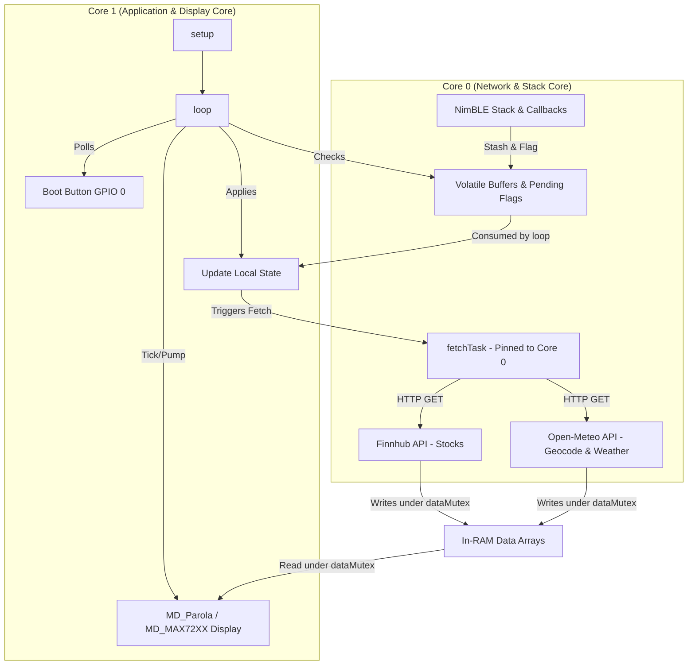
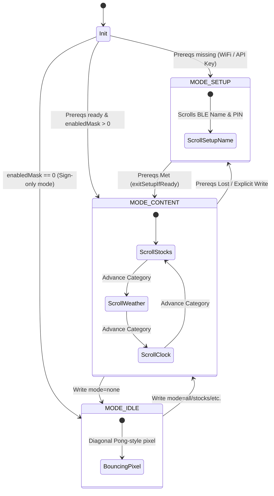

# Firmware Deep-Dive and Interaction Guide

This document provides a comprehensive developer and agent-oriented guide for the ESP32-S3 LED Ticker firmware. It covers the codebase architecture (`firmware/src/main.cpp`), state-machine logic, BLE communication contracts, hardware interactions, memory-safety considerations, and checklists for extending the firmware.

---

## 1. System Architecture & Multitasking

The firmware is designed around a dual-core model to prevent network latency (which can be seconds) from interrupting the smooth scrolling of the LED matrix.



### 1.1 Core Assignment
- **Core 0 (Task: `fetchTask`):** Handles background HTTP/HTTPS requests to external APIs (Finnhub for stocks, Open-Meteo for geocoding and weather). Pinned to Core 0 with an 8KB stack (`FETCH_TASK_STACK = 8192`).
- **Core 1 (Task: Main `loop()` / `setup()`):** Handles MAX7219 LED matrix driving, hardware button polling, BLE connection tracking, and applying deferred state updates.

### 1.2 Data Synchronization & Thread Safety
- **`dataMutex` (FreeRTOS Semaphore):** Protects reading and writing of `stockQuotes` and `weatherReadings` arrays.
  ```cpp
  xSemaphoreTake(dataMutex, portMAX_DELAY);
  // Copy or read array elements
  xSemaphoreGive(dataMutex);
  ```
- **Volatile Pending Flags:** Write operations from BLE callbacks (running on Core 0 in NimBLE threads) are stashed in RAM, and volatile boolean flags are set. Core 1 polls these flags in the main loop and safely applies changes to the application state (e.g., `wifiUpdatePending`, `apiKeyUpdatePending`, `cmdPending`, etc.).
- **NeoPixel Gating:** The Freenove WS2812 status LED (GPIO 48) is driven only from Core 1. The background thread on Core 0 sets the volatile boolean `fetching` flag, which Core 1 consumes in `updateStatusLed()`. **Rule:** Never call `neopixelWrite()` from Core 0; doing so can cause ESP32-S3 driver lockups.

---

The firmware supports several display modes and orthogonal visual overrides. The main `loop()` determines rendering precedence on every tick.

> [!NOTE]
> For full conceptual details of mode state bitmasks, display advance rules, Setup/Idle timeout behaviors, geocoding calculations, and NYSE market hours logic, refer to [ARCHITECTURE.md](../ARCHITECTURE.md).




### 2.1 Rendering Precedence (`loop()`)
Precedence is evaluated in this order:
1. **Reset Button Hold (Highest):** If GPIO 0 is pressed and held, the screen clears and displays the countdown to factory reset (e.g., `"8"`, `"7"`, ...).
2. **Display Power State:** If `displayOff` is `true`, screen is blanked, fetches are paused, and the loop yields (`delay(100)`).
3. **Timer Mode (`timerPhase != TIMER_OFF`):** Displays countdown `MM:SS` or plays the zero-minute explosion end animation.
4. **Status Sign (`checkStatusForRender()`):** If status text is active and unexpired, renders static text (with breathing animation if ≤ 5 chars) or loops scrolling text.
5. **Idle Mode (`MODE_IDLE`):** Bounces a single diagonal pixel across the matrix.
6. **Static Clock Fast Path:** If `enabledMask == BIT_CLOCK` (clock only) and NTP is ready, renders a steady `H:MM` center-aligned (bypassing scroll animation pump).
7. **Normal Scroll Pump:** Drives either the setup scrolls (`MODE_SETUP` scrolling BLE name + PIN) or rotating categories (`MODE_CONTENT` scrolling stocks/weather/clock).

---

## 3. BLE Deferred-Write Mapping

To prevent blocking the NimBLE execution context, BLE writes are stashed, flagged, and deferred to Core 1. Below is the mapping of BLE characteristics to their backing variables and functions.

> [!NOTE]
> For complete specifications on characteristic payloads, command verbs, timezone formats, power state values, and display settings string structures, refer to [BLE_PROTOCOL.md](../BLE_PROTOCOL.md).


| Characteristic | UUID (`beb5483e-36e1-4688-...`) | Callback Class | Stash Buffer | Apply Function | NVS Namespace / Key |
|---|---|---|---|---|---|
| **Tickers** | `...26a8` | `TickerCallbacks` | `pendingTickerStr` | `applyPendingTickers()` | `tickers` / `t0`, `t1`... |
| **Mode** | `...26a9` | `ModeCallbacks` | `pendingModeStr` | `applyPendingMode()` | `display` / `mask` |
| **Command** | `...26ab` | `CmdCallbacks` | `pendingCmd` | `applyPendingCmd()` | *Write-only (NVS wiped on reset)* |
| **WiFi** | `...26ac` | `WifiCallbacks` | `pendingWifiStr` | `applyPendingWifi()` | `wifi` / `ssid`, `pass` |
| **API Key** | `...26ad` | `ApiKeyCallbacks` | `pendingApiKey` | `applyPendingApiKey()` | `apikey` / `key` |
| **Locations** | `...26ae` | `LocsCallbacks` | `pendingLocsStr` | `applyPendingLocations()` | `locs` / `l0`, `l1`... |
| **Status** | `...26af` | `StatusCallbacks` | `pendingStatusStr` | `applyPendingStatus()` | *RAM-only* |
| **Version** | `...26b0` | `VersionCallbacks` | *Read-only* | *None* | *Hardcoded define* |
| **Power** | `...26b1` | `GatedStashCallbacks` | `pendingPowerStr` | `applyPendingPower()` | *RAM-only* |
| **Auth** | `...26b2` | `AuthCallbacks` | *Immediate match* | *Processed in Callback* | `pin` / `code` |
| **Display** | `...26b3` | `DisplayCfgCallbacks` | `pendingDisplayCfgStr`| `applyPendingDisplayCfg()` | `display` / `bright`, `scroll` |
| **Timezone** | `...26b4` | `TimezoneCallbacks` | `pendingTzStr` | `applyPendingTimezone()` | `time` / `tz` |

### 3.1 Network Write Cooldown
To prevent clients from hammer-retrying and depleting APIs:
- Tickers, Locations, `Command=reload`, and `Command=reset` are rate-limited by `BLE_FETCH_COOLDOWN_MS = 10000` (10 seconds).
- Status (sign writes) are **not** rate-limited so they respond instantly.

---

## 4. Security, Authentication & Rate Limiting

The BLE interface enforces a PIN-gate on all configuration writes when `nvsPinEnforce` is `true`.

### 4.1 Pairing Modes
1. **Passkey-Entry Bonding:** Serves standard Bluetooth security (`bond=true`, `MITM=true`, `SC=true` with `DISPLAY_ONLY` capability). iOS prompts native passcode dialog. `onPassKeyRequest()` returns the NVS PIN.
2. **PIN Write (Fallback):** Writing the PIN directly to the Auth characteristic (`...26b2`). If successful, flags the connection handle as authorized. Used by CLI or clients unable to trigger native bonding.

### 4.2 Auth Memory Structure (`AuthSlot`)
Up to 4 concurrent connections are tracked:
```cpp
struct AuthSlot {
  uint16_t handle;
  bool inUse;
  bool authed;
  uint8_t failCount;
  uint32_t lockoutUntilMs;
};
```

### 4.3 Lockout & Security Timing
- **Brute Force Defense:** 5 consecutive failed PIN writes on a slot locks out further Auth writes on that connection handle for 5 seconds (`AUTH_LOCKOUT_MS = 5000`).
- **Lockout Safety:** Lockout timer checks are wrap-safe via signed subtraction:
  ```cpp
  if (s->lockoutUntilMs && (int32_t)(millis() - s->lockoutUntilMs) < 0) return; // ignore write
  ```
- **Disconnected Cleanup:** On client disconnect, `ServerCallbacks::onDisconnect()` frees the connection's `AuthSlot`.

---

## 5. Critical Memory Safety & Hardware Rules

When writing or modifying code in this codebase, adhere strictly to these rules:

### 5.1 MD_Parola Pointers & Strings
> [!IMPORTANT]
> `MD_Parola` stores pointers, not copies, of the strings passed to `displayScroll()` or `displayText()`.
- Passing a stack-local character buffer to Parola causes undefined memory reads and screen corruption once the stack frames peel back.
- **Solution:** Always use static buffers (like `scrollBuf`, `statusShown`, or static `buf` inside functions) for text buffers passed to the display.

### 5.2 Serial Non-Blocking Writes
- `Serial.setTxTimeoutMs(0)` is executed immediately in `setup()`.
- When operating headless (e.g., no USB host connected), writing to the default Serial TX buffer blocks for up to 250ms per call once full. This causes noticeable scroll stuttering. Setting timeout to `0` drops the bytes instead of blocking the execution loop.

### 5.3 SNTP Time Init Gate
- **Rule:** Never call `configTzTime()` / start NTP without a working Wi-Fi connection.
  ```cpp
  if (WiFi.status() != WL_CONNECTED) return; // Mandatory gate
  ```
- **Reason:** In older Espressif IDF layers, starting the lwIP SNTP daemon with no active gateway causes DNS retry queries to queue infinitely, leading to heap fragmentation and firmware crashes after ~10 minutes of operation.

---

## 6. Developer Checklists for Future Extensions

### 6.1 Adding a New BLE Characteristic
1. **Define the UUID:** Add a new characteristic UUID in `main.cpp` matching the `beb5483e-36e1-4688-b7f5-ea07361b26XX` pattern.
2. **Define volatile variables:** Create a volatile flag (e.g. `volatile bool myUpdatePending = false`) and a stash buffer.
3. **Write Callback Class:** Inherit from `GatedStashCallbacks` (or `NimBLECharacteristicCallbacks` if custom logic is required).
4. **Register in `initBLE()`:**
   ```cpp
   pService->createCharacteristic(MY_UUID, NIMBLE_PROPERTY::READ | NIMBLE_PROPERTY::WRITE)
           ->setCallbacks(new MyCallbacks());
   ```
5. **Handle inside `loop()`:** Add flag check and call an apply function.
6. **Implement Apply Function:** Convert input, validate, write to NVS (if persistent), and clear the pending flag.

### 6.2 Adding a New Display Category
1. **Define Mode Bit:** Add a new bitmask (e.g. `#define BIT_NEWS 0x10`) and update `MASK_ALL`.
2. **Define RAM Data Structures:** Create structs and arrays for the category data, and update `dataMutex` usage inside the fetch routines.
3. **Add Data Fetch Logic:** Implement the HTTP/HTTPS request inside `fetchTask` in Core 0.
4. **Implement Renderer:** Create `showNextNews()` using a static or global buffer and call `scrollText()`.
5. **Update Category Rotation:** Update `bitHasData()`, `nextBit()`, `advanceCategory()`, and `firstActiveBit()` to include the new category.

### 6.3 Adding a Command Verb to `Command` characteristic
1. **Edit `applyPendingCmd()`:** Locate the check blocks for `reload`, `reset`, `pin-enforce`, or `timer`.
2. **Define parsing logic:** Parse command arguments (use `strncmp` for prefixes).
3. **Add action logic:** Implement logic or set flags to trigger actions in `loop()`.
4. **Update `BLE_PROTOCOL.md`:** Document the new verb, its parameters, and its behavior.
