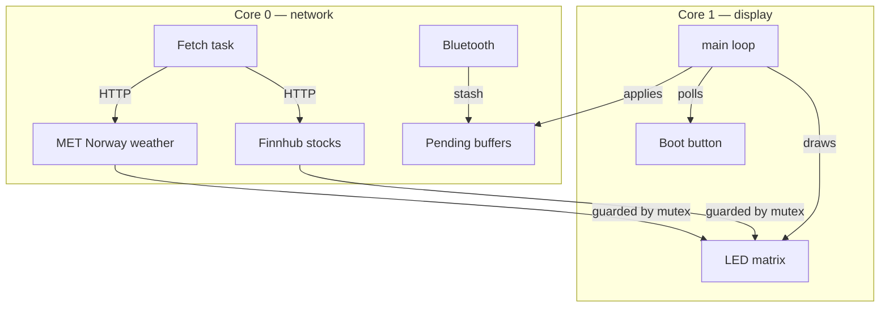
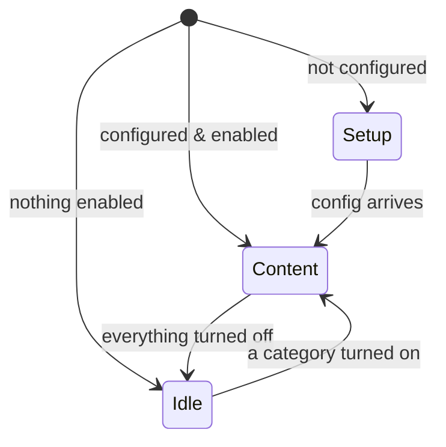

# Firmware Guide

How the ESP32-S3 LED Ticker firmware works, at a high level. The detail lives in the code — `main.cpp` is structured and commented — and the Bluetooth wire format is in [`BLE_PROTOCOL.md`](../BLE_PROTOCOL.md). This is the map, not the territory.

## What it does

Drives a 4-panel LED matrix with two independent layers:

- **Ambient rotation** — cycles through whatever's enabled: stock quotes, weather, and a clock.
- **Override** — a text sign or a countdown timer that takes over the whole panel until it clears, then ambient resumes.

If it hasn't been configured yet (no WiFi or API key), it drops into a **setup** mode instead.

## Two cores

Network calls take seconds; the scrolling has to stay smooth. So the work is split across the ESP32's two cores:

- **Core 0** fetches data over WiFi and runs the Bluetooth stack.
- **Core 1** does everything you see — drives the matrix, runs the display modes, watches the button.

They hand off through shared buffers protected by a mutex. Bluetooth writes never draw or touch the network directly: a callback just stashes the incoming value, and Core 1 picks it up and applies it on its next pass. That keeps the radio and the display from stepping on each other.

## Display modes

Three top-level modes, plus the override layer on top.

- **Setup** — not yet usable. Scrolls its Bluetooth name (`LED-Ticker-XXXX`) so you can find it in the app and configure it.
- **Content** — the normal state. Rotates through the enabled categories, skipping any that have no data yet.
- **Idle** — sign-only. Nothing in the rotation, so a single pixel bounces around the panel to show it's alive.

**The override layer** sits above all three. A text sign (short text holds steady; longer text scrolls) or a countdown timer takes over the panel. The timer counts down `MM:SS` and finishes with a brief explosion animation before ambient resumes. The two overrides are mutually exclusive — starting one cancels the other.

When several things want the screen at once, this is the priority order: a factory-reset countdown wins over everything, then power-off (blank), then the timer, then a text sign, then the normal idle/ambient rotation.

## How it's controlled

**Bluetooth is the real control plane** — the iOS app talks to it, and that contract (the protocol) is what lets the app evolve without firmware changes. A **USB serial console** mirrors every command; it's there for development and is the only way to drive the device in the Wokwi simulator, where Bluetooth isn't available.

Configuration writes are PIN-gated. The PIN shows on the panel during setup and prints to serial at every boot.

What's saved and what isn't: configuration (WiFi, keys, tickers, locations, brightness, timezone, PIN) persists in flash. Fetched quotes/weather and the active sign are **RAM-only** — a power cycle throws them away and comes back to a clean ambient rotation.

## Where the data comes from

Every few minutes Core 0 refreshes stock quotes (Finnhub) and weather (MET Norway), and the clock syncs from NTP. A couple of things worth knowing:

- Stocks only fetch during US market hours; off-hours it keeps showing the last prices.
- The device doesn't look up locations itself — the app resolves a place name to coordinates and sends those, so the firmware stays simple and keyless for weather.

## Resetting

A factory reset wipes all configuration, forgets paired devices, rotates the PIN, and reboots into setup. Two ways to trigger it — hold the BOOT button for 10 seconds, or send a reset command from the app. Both show a visible countdown you can abort first (release the button, or power-cycle the device).

## If you're editing the firmware

A handful of non-obvious invariants the code depends on — break these and things misbehave in confusing ways:

- **The main loop is cooperative.** Never `delay()` in the middle of it; animations are timed off `millis()` instead, so nothing blocks the scrolling or the radio.
- **Only Core 1 touches the status LED.** Driving it from the fetch task can lock up the LED driver.
- **Don't start the clock (NTP) before WiFi connects** — it wedges the device.
- **Text handed to the display must outlive the call.** The matrix library keeps the pointer you give it, not a copy, so use a static/global buffer, never a local one.

Everything else — exact pin assignments, NVS keys, characteristic UUIDs, the fetch and render functions — is in the source and in [`BLE_PROTOCOL.md`](../BLE_PROTOCOL.md). Read those for specifics; this guide is just the shape of things.
