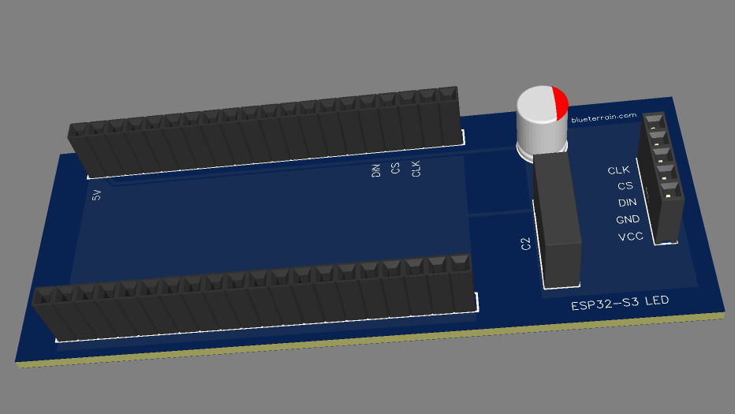

# Custom PCB

Carries the Freenove module + a MAX7219 matrix header on a single board. Designed in [EasyEDA](https://easyeda.com/); order via JLCPCB. Sources, mechanical drawing, 3D model, and render all live in this folder.

  

## Files

| File | What |
|------|------|
| `EasyEDA_PCB.json` | EasyEDA source project — open this to edit |
| `EasyEDA_PCB.dxf` | Mechanical drawing |
| `EasyEDA_PCB.obj` / `EasyEDA_PCB.mtl` | 3D model + material |
| `pcb.png` | 3D render |

The board is footprint-specific to the **Freenove ESP32-S3-WROOM (FNK0099)** — see [Getting started](../GETTING_STARTED.md#hardware--wiring) for the matching wiring.
